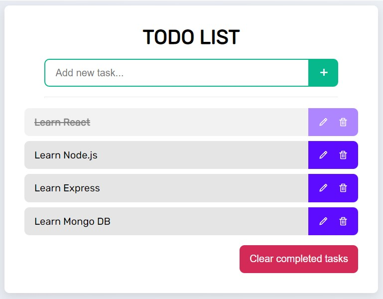

# Todo List

A basic todo list application developed in **React** using Hooks for add, delete, edit and complete custom tasks.

## [Try demo](https://ju4npx.github.io/todo-list/)



### Table of contents 📃

- [Todo List](#todo-list)
  - [Try demo](#try-demo)
    - [Table of contents 📃](#table-of-contents-)
  - [Starting 🚀](#starting-)
    - [Pre-requirements 📋](#pre-requirements-)
    - [Installation 🔧](#installation-)
  - [Deployment 📦](#deployment-)
  - [Built with 🛠️](#built-with-️)


## Starting 🚀
  
### Pre-requirements 📋

* [Git](https://git-scm.com/)
* [React](https://es.reactjs.org/docs/getting-started.html)

### Installation 🔧

Local installation:

```bash
# Clone this repository
$ git clone https://github.com/Ju4npx/todo-list.git

# Change directory to the project path
$ cd todo-list
```

Setup:
```bash
# Install dependencies
$ npm install
```

## Deployment 📦

```bash
# Run application
$ npm run start
```
Open [http://localhost:3000](http://localhost:3000) to view it in your browser.

## Built with 🛠️

* [React](https://es.reactjs.org/) - Frontend framework

---
⌨️ with ❤️ by [Juan Pablo Machado](https://github.com/Ju4npx ) 😊 